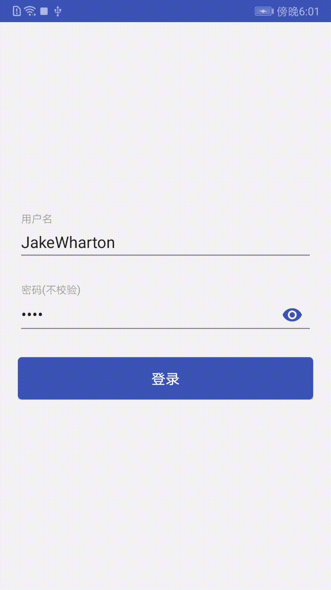

# AndroidMVP
一个整合了大量主流开源项目的 Android MVP 快速集成框架，整合Retrofit+RxJava网络模块的快速开发框架。

## 框架特点

- **MVP结构**

    1. 表示层 <=> 业务层 => 数据层
    2. View <=> Presenter => Model

- **流行框架**

	1. [retrofit](https://github.com/square/retrofit)+[okhttp](https://github.com/square/okhttp)+[rxJava](https://github.com/ReactiveX/RxJava)负责网络请求
    2. [gson](https://github.com/google/gson)负责解析json数据
    3. AndPermission 权限管理
    4. SmartRefreshLayout 下拉刷新

- **基类封装**

	1. BaseActivity
	2. BaseFragment
    3. BasePresenter

- **全局操作**

	1. 全局的Activity堆栈式管理
	2. LoggingInterceptor全局拦截网络请求日志
   	3. 全局的异常捕获，程序发生异常时不会崩溃，返回上个界面。
   	4. 使用androidx

## 注意

    1. 接口使用GitHub API v3，单IP限制每小时60次requests
    2. mipmap文件夹只存放启动图标icon
    3. Android手机屏幕标准                    对应图标尺寸标准      屏幕密度       比例
    4. xxxhdpi 3840*2160                         192*192             640          16
    5. xxhdpi 1920*1080                          144*144             480          12
    6. xhdpi  1280*720                            96*96              320           8

## 效果图

